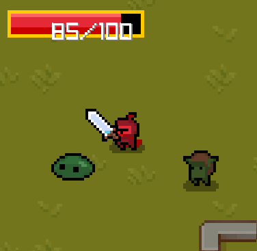

# Clash-With-Class-Advanced

This project is an extension of a project developed while working on the final project in the lecture series [C++ Fundamentals: Game Programming For Beginners](https://www.gamedev.tv/p/cpp-fundamentals). After completing this project initially I created a to-do list of features I wanted to challenge myself in implementing.
Additionally, as I progressed in my studies at formal education institutions, I tried to implement topics that I learned from those programs as well.

This program makes use of the [Raylib library](https://www.raylib.com/) which packages a number of core libraries that support graphics, audio tools, and vector mathematics into a single source.

Initially this program was created in VSCode, but I have since migrated it into development in Visual Studio 2019 (hence the branch name) which is now the primary build going forwards.

## Clash With Class (Advanced)

The goal of the game is to find and destroy all of the enemy monsters in the scene. Be quick, as additional enemies will spawn if you're not fast enough!

This program makes use of inheritance and polymorphism to create variations on a Base Character object in order to create interations in a game space world. Primarily the Base Character function Tick() drives the movement in each frame, updating how each object is drawn in the space. The additional functionalities unique to each individual object is further defined in their own classes. 

## TODO

- ~~Invincible time & color flash~~ :white_check_mark:
  - I was in the process of working out a way to set the player status to invincible and flash white when taking damage :heavy_check_mark:
  - Color Flash:heavy_check_mark:

- Enemy variants
  - I want to add additional variants of enemies without the addition of new art assets. I'd like to indicate color representing enemy challenge rating (health total) // the methods for altering texture colors using raylib alone is difficult, but I'm wondering if I might be able to use one of the other graphics libraries to achieve the same goal

- ~~Change enemy damage behavior~~  :white_check_mark:
  - Currently enemies produce continuous damage when contact is made with the player. When finished with current changes enemy behavior should produce the following: (Please excuse nebulous language):heavy_check_mark:
  - Enemies will reach acceptable follow radius distance:heavy_check_mark:
    - Perform charge animation. Towards the end of charge time, enemy will store a reference to the player's position in world space:heavy_check_mark:
    - Will dash at faster speed towards locked location of player :heavy_check_mark:
    - Return to chase after brief pause :heavy_check_mark:
   
- Localized character checking // todo
  - Currently there are several instances where we check for collisions of objects regardless of their proximity, such as when the player "attacks", we check if the sword collision rec overlaps with an enemy collision rec. This is unnecessary if we created a localized check first in a grid system based on where the character is currently. If we only check entities who exist in a set of nearby grid squares to the character, we can optimize these collision checks.
  - To do this, my plan is to implement a mapwide grid for testing and detection of where the player is. We can then check the adjacent grid squares for enemies or other collide-ables. Any objects not present in adjacent squares can be ignored from checks.

## The map

- The map is a 2D texture that I created. It is initialized at a 0,0 position and then scaled up by a set amount used, called notated as our scale value. As the player move's the portion of the map displayed on screen is adjusted along with all other objects in the scene to simulate accurate movement.

## The player

- The player (character class) is initialized at its starting position in the world. The player's movement is determined by a vector called velocity, which is generated by detecting in put from the WASD key input from the user. This velocity is then used to drive the appearance of movement. The key part is that the character's movement drives the screen position, which always has the player in its center, all other movement is adjusted by the player's velocity to keep their positions accurate to the space.
  
- The knight also has the ability to attack, by clicking the left mouse button. The swing attack is also dependent on the position of the player's mouse in the screen, swinging and facing to the left if the mouse is to the left of the player character and to the right if the mouse is on the right of the player character. Hitting an enemy character on a swing removes that enemy from the Enemies vector, no longer rendering it (in doing this I had also attempted to call its destructor but would need to do more testing on this feature). When this is empty, it triggers a win state. 

## The enemy

- This is part of where my additional challenges came into play. Initially the Enemies would attempt to deal damage to the player as long as they were standing on them. I wanted to implement a sort of dash attack towards the direction of the player, once the enemy has gotten within an attacking range.
- To do this, I implemented a state machine pattern within the enemy class so that the enemy would be able to transition between chasing states and dashing states, making use of some set variable to count down time in order to initiate a dash.
- The dash direction became a sort of extension of the velocity vector, calculating the distance necessary to cover between the enemy object and the player. From this extension I calculated an end destination. However this end destination is created by referencing the "screen space" of both the player and enemy objects. So I needed to implement a way to update the target position (this end of dash point) if the player moved, otherwise, this endpoint would maintain the same position on the screen if the player were to move.
  - Current implementation to do so involved creating a private member variable in the character class, and a private getter function to get that variable's value. This variable would store the player character's velocity as it is not accessible from outside of the class, and even if it were to be made accessible, in a single Character's tick function, the velocity vector is zeroed out halfway through that function. Caching this value allows us to use it for further calculations as necessary.
  - There were some other thoughts on attempting this functionality, I had tried to calculate the vector value between the enemy and the player and taking the components of that vector in order to find the velocity some other way, however this proved more time consuming than I had hoped. I might want to try implementing a similar solution at some point in the future.

- The current dash implementation of an enemy checks if the enemy crosses the player object (by comparing its collision rectangles) and if there is a collision, the player takes 20 points of damage.
  - In the future, I would like to create additional enemies whose damage value is higher than standard enemies, additionally might have a larger collision box, or a different style of attack.

## KNOWN ISSUES
- Sometimes the enemies collide with each other and have a difficult time of getting 'un-collided'. I've been looking for a more elegant solution to this problem, but I think I may need some more time to implement this functionality.
